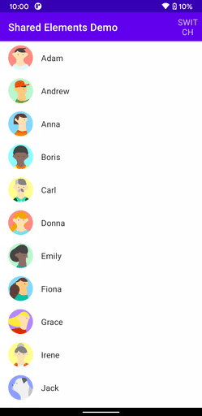

# Shared Elements Transition for Jetpack Compose

Originated from [mobnetic/compose-shared-element](/mobnetic/compose-shared-element).

Shared elements transition implementation for compose with various customization options.
Currently providing the following transition patterns:
* Standard shared elements transition
* [Material container transform](https://material.io/design/motion/the-motion-system.html#container-transform) (which basically mimics the [`MaterialContainerTransform`](https://developer.android.com/reference/com/google/android/material/transition/MaterialContainerTransform) of MDC-Android library)

 

## How to use

1. Define elements with the same `key` and different `screenKey`s using `SharedElement` or `SharedMaterialContainer` composables.
2. Wrap different screens in a single `SharedElementRoot`.

Transition will start when elements with the same key are detected.

## Notes

* `SharedElementsTransitionSpec` of the start element will be used.
* Transition is only applied to the shared elements, so you have to define the transition for the rest yourself. See the [demo](demo) for examples. If you want to prevent an element from showing in your self-defined transition, call `prepareTransition(key)`.
* Elements are composed separately in an overlay during transition, so `remember` won't work as expected. If your element is stateful, define the state outside the `SharedElement` or `SharedMaterialContainer` composables.
